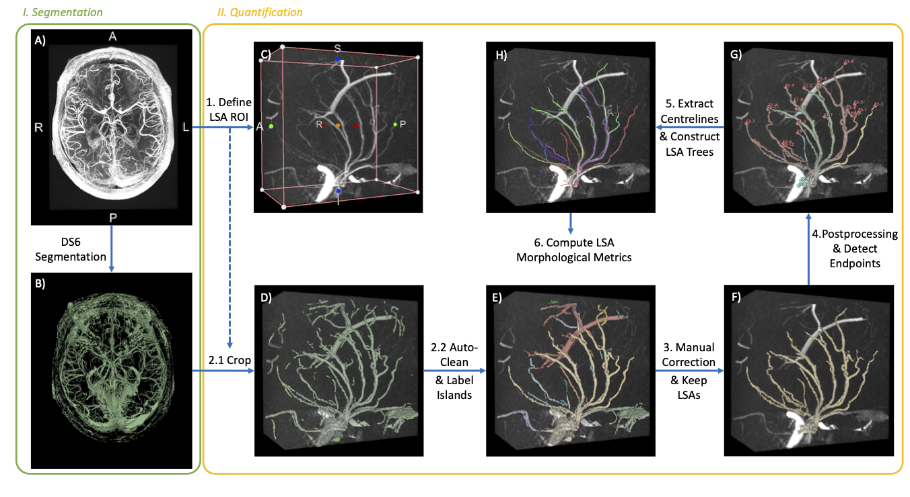
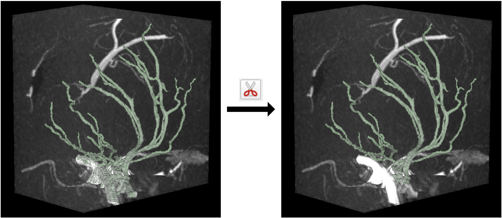

# LSA_3D_Morph
This is the official code repository for the paper, R. Li *et al*. "A Deep Learning Pipeline for Analysis of the 3D Morphology of the Cerebral Small Perforating Arteries from Time-of-Flight 7 Tesla MRI", 2024.  
You may use our code to extract metrics of the 3D morphology of lenticulostriate arteries (LSA) from 7T Time-of-Flight (TOF) MRI.  

## Configuration
### Python Environment
We used Python version 3.12.2. Follow these steps to create the Conda environment using the provided `environment.yml` file:

1. Clone the repository:
    ```sh
    git clone https://github.com/RuiLiGitLove/LSA_3D_Morph.git
    cd LSA_3D_Morph
    ```

2. Create the Conda environment:
    ```sh
    conda env create -f environment.yml
    ```

3. Activate the environment:
    ```sh
    conda activate 7T-Project-env
    ```
In addition, please install the [AFNI (Analysis of Functional NeuroImages)](https://afni.nimh.nih.gov/) software to your system for isotropic resampling of the TOF images. The version of AFNI that we used was 17.0.00.

### 3D Slicer
The quantification stage of our pipeline requires the use of the free software, [3D Slicer](https://www.slicer.org/). Please install the latest version of Slicer to your system. We tested on version 5.6.2.  
#### Download Extensions
Download the following extensions from Slicer "Extensions Manager"  :
- SlicerVMTK
- SegmentEditorExtraEffects  

#### Configure `.slicerrc.py`
This is a Python script that comes with Slicer installation. Slicer automatically loads this script every time it is launches, and you can modify default settings and create new functions through this script.  

To locate this script, launch Slicer, and go to `Edit -> Application Settings -> General -> Application startup script`. Add the content of file, `Quantification/slicerrc.py`, from this repository into your `.slicerrc.py`, and replace the path for `mip_vp_file` (line 18) with the path to `Quantification/MIP_VolumeProperty.vp` on your machine -- this sets the volume property that was best for us to visualise the volume in the 3D view, but feel free to change it based on your data.

## Pipeline


### 0. Data Preperation
Please prepare your TOF image as a compressed NIFTI file (`.nii.gz`). To ensure that the 3D structure in the image is not distorted due to unisotropic voxel size, please isotropically upsample your image to the smallest voxel dimension. To do this, we recommend using the `3dresample` function from AFNI.
```sh
3dresample -overwrite -dxyz {d} {d} {d} -rmode Cu -prefix {output_path} -inset {input_path} # replace {d} with the minimum voxel dimension; replace with your own input and output paths
``` 
### I. Vessel Segmentation  
This step performs automatic segmentation on the entire isotropically resampled TOF image. We recommend using the DS6 deep learning approach. Alternatively, you may also use the MSFDF pipeline. 

#### DS6 (Recommend)
We recommend using the deep learning model, DS6, for better performance. The original paper  is  

> S. Chatterjee et al., ‘DS6, Deformation-Aware Semi-Supervised Learning: Application to Small Vessel Segmentation with Noisy Training Data’, J Imaging, vol. 8, no. 10, p. 259, Sep. 2022, doi: 10.3390/JIMAGING8100259.

A newer version of the DS6 pipeline has been published as SPOCKMIP at https://github.com/soumickmj/spockmip. Please use this pipeline and follow its instructions. Our finetuned DS6 model is available on Huggingface at https://huggingface.co/soumickmj/SMILEUHURA_DS6_CamSVD_UNetMSS3D_wDeform.

#### MSFDF (Alternative)
The Multi-Scale Frangi Diffusive Filter (MSFDF) pipeline was published in this paper 

>M. Bernier, S. C. Cunnane, and K. Whittingstall, ‘The morphology of the human cerebrovascular system’, Hum Brain Mapp, vol. 39, no. 12, pp. 4962–4975, Dec. 2018, doi: 10.1002/HBM.24337.  

We adapted its code from https://github.com/braincharter/vasculature_notebook [*last accessed on 13 Sep 2024*]. To use our version, run `MSFDF_main.py` in the subdirectory `MSFDF`.

### II. LSA Quantification
This stage uses the segmentation mask and extracts morphological metrics of the LSAs. Please use the jupyter notebook at `Quantification/quantification_main.ipynb` and follow the instructions below.  

#### 1. Define LSA ROI (manual)
- Launch 3D Slicer and load the isotropically sampled TOF file as 'Volume'.  
- Go to `Volume Rendering` module and toggle visibility. In `Inputs -> Property`, you may select the custom `MIP_VolumeProperty` (loaded in .slicerrc.py).  
- Select `Display ROI`, drag the ROI box to cover the LSAs and their origins, and use the `get_ROI_slicer_idx()` function in the Python Console as shown to get the location of the ROI. **Make sure to have only one volume file loaded at this step to obtain the correct ROI location!**
- Save the index location to `Quantification/LSA_ROI_location.json`. Specify `ID` and `side`.  


#### 2. Obtain segmentation inside ROI (automatic)
Follow step 2 in `quantification_main.ipynb`. This will crop both the segmentation mask and TOF using the ROI location defined above and save the files in a new directory inside the ID data directory. In addition, it creates `labelled_seg.nii.gz`, which is the automatically cleaned segmentation mask with each disjoint island labelled with a different number, and `helper_endpoints.json`, which stores the endpoints of each disjoint island. 
 
#### 3. Manual correction and keep LSAs (semi-manual)
- Load the cropped TOF image, `labelled_seg.nii.gz` and `helper_endpoints.json` into Slicer. 
- Go to `Segment Editor` module and correct the segmentation of the LSAs. Note that **you only need to check the segmentation of the LSAs and the part of the main artery that they are connected to**. You do not need to manually remove all non-LSA islands, as in the next step only the largest island will be retained.
- Clicking on the endpoints in 3D view can take you to those locations directly in the slice views.
- Some tools that we find useful for this step are `Paint`, `Eraser`, `Scissors`, `Draw Tube` (circled in image below). `Draw Tube` is particularly useful for filling parts of LSAs that are missed in the automatic segmentation -- **always create a new segment when using `Draw Tube` to avoid overwritting an existing segment!**
- Save your corrected segmentation to default filename `labelled_seg.nii.gz.nii.seg.nrrd`.

- Run step 3.2 in `quantification_main.ipynb` to keep only the largest island in the segmentation.
- Load the new segmentation, `LSA_MCA_seg.nii.gz`, into Slicer. Cut off the MCA, and save the final LSA mask at the default filename `LSA_MCA_seg.nii.gz.nii.seg.nrrd`.


#### 4. Postprocessing and detect endpoints (automatic)
- Follow step 4 in `quantification_main.ipynb`. 
- Load the postprocessed segmentation mask, `labelled_LSA_seg.nii.gz`, and all the detected endpoint files, e.g. `F1.json`, into Slicer to double check. Each segment in `labelled_LSA_seg.nii.gz` corresponds to the LSA branches originating from a different stem. `F1.json` stores the endpoints for segment 1, and similarly for other segments. The origin endpoints should be toggle selected as blue.
- If the automatically detected endpoints are wrong, you may drag them to the correct location. You may use the `Extract Centerline` module to add new endpoints to each list.
- If you modified the endpoints, save them to the same json files.

#### 5. Centreline extraction and construct LSA trees (automatic)
Follow step 5 in `quantification_main.ipynb`. This step will automatically launch a new slicer window to show the centrelines extracted. Once it's finished, you may freely rotate the view to examine the results. All extracted centrelines and the scene file will be automatically saved in a new `Results` folder.


#### 6. Compute LSA metrics (automatic)
Follow step 6 in `quantification_main.ipynb` to compute the final LSA metrics.

## Credits
If you like this repository, please click on Star!  
If our work helped your research, please kindly cite our paper:
{Add citation here}

```
{Add Latex citation here}
```
@Author: Rui Li <rl574@cam.ac.uk>  