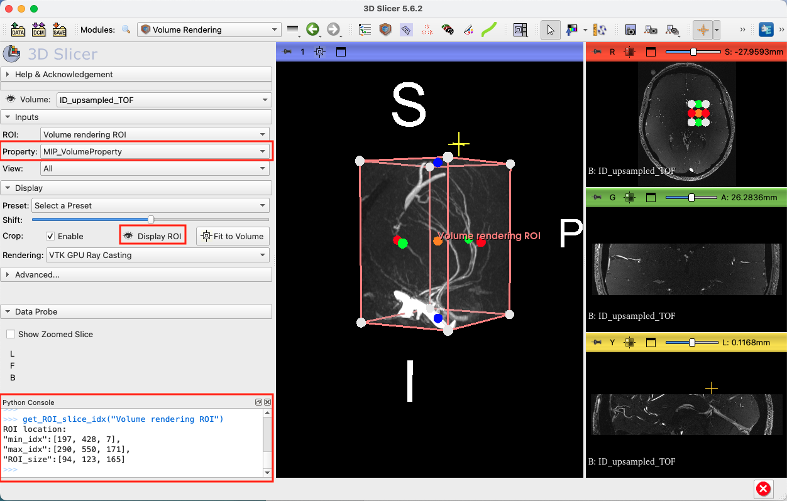
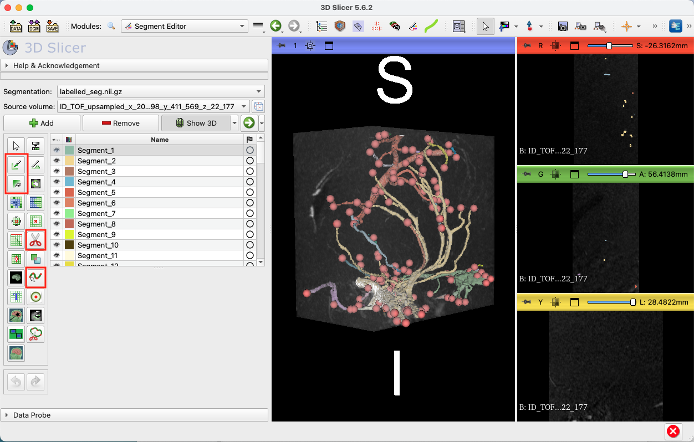
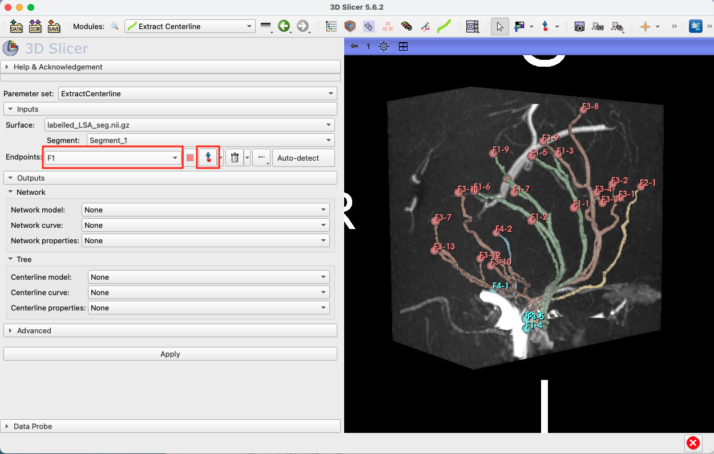
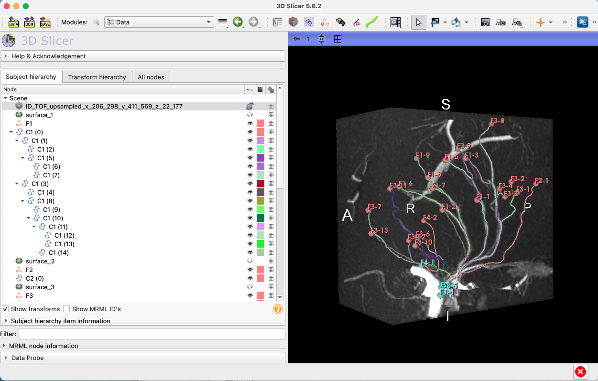

# LUMEN
This is the official code repository for the **LUMEN** (**L**enticulostriate artery **U**ltra-high-field **M**orphology **E**xtraction and quantificatio**N**) pipeline. For details, please refer to paper, R. Li *et al*. "A Deep Learning Pipeline for Analysis of the 3D Morphology of the Cerebral Small Perforating Arteries from Time-of-Flight 7 Tesla MRI", 2024 (in submission).   

## Configuration
### Python Environment
We used Python version 3.12.2. Follow these steps to create the Conda environment using the provided `environment.yml` file:

1. Clone the repository:
    ```sh
    git clone https://github.com/RuiLiGitLove/LUMEN.git
    cd LUMEN
    ```

2. Create the Conda environment: our pipeline was developed on a Mac OS, thus we provide the environment yaml file for mac at `Environment/environment_macos_arm64.yaml`. If on a different operating system, try using `Environment/environment_from_history.yaml` instead.
    ```sh
    conda env create -n LUMEN-env -f Environment/environment_macos_arm64.yml
    ```

3. Activate the environment:
    ```sh
    conda activate LUMEN-env
    ```
In addition, please install the [AFNI (Analysis of Functional NeuroImages)](https://afni.nimh.nih.gov/) software to your system for isotropic resampling of the TOF images. The version of AFNI that we used was 17.0.00.

### 3D Slicer
The quantification stage of our pipeline requires the use of the free software, [3D Slicer](https://www.slicer.org/). Please install the latest version of Slicer to your system. We tested on version 5.6.2.  
#### Download Extensions
Download the following extensions from Slicer "Extensions Manager"  :
- SlicerVMTK
- SegmentEditorExtraEffects  

#### Configure `.slicerrc.py`
This is a Python script that comes with Slicer installation. Slicer automatically loads this script every time it is launches, and you can modify default settings and create new functions through this script.  

To locate this script, launch Slicer, and go to `Edit -> Application Settings -> General -> Application startup script`. Add the content of file, `Quantification/slicerrc.py`, from this repository into your `.slicerrc.py`, and replace the path for `mip_vp_file` (line 18) with the path to `Quantification/MIP_VolumeProperty.vp` on your machine -- this sets the volume property that was best for us to visualise the volume in the 3D view, but feel free to change it based on your data.

## Pipeline


### 0. Data Preperation
Please prepare your TOF image as a compressed NIFTI file (`.nii.gz`). To ensure that the 3D structure in the image is not distorted due to unisotropic voxel size, please isotropically upsample your image to the smallest voxel dimension (0.24mm in our case). To do this, we recommend using the `3dresample` function from AFNI.
```sh
3dresample -overwrite -dxyz {d} {d} {d} -rmode Cu -prefix {output_path} -inset {input_path} # replace {d} with the minimum voxel dimension; replace with your own input and output paths
``` 
### I. Vessel Segmentation  
This step performs automatic segmentation on the entire isotropically resampled TOF image. We found the deep learning model, DS6, to be the best performing model. Alternatively, you may also use our trained nnU-Net model or the MSFDF pipeline. 

#### 1. DS6 (Recommended)
If you are using the DS6 model, please also cite the original DS6 paper:  

> S. Chatterjee et al., ‘DS6, Deformation-Aware Semi-Supervised Learning: Application to Small Vessel Segmentation with Noisy Training Data’, J Imaging, vol. 8, no. 10, p. 259, Sep. 2022, doi: 10.3390/JIMAGING8100259.

A newer version of the DS6 pipeline has been published as SPOCKMIP at https://github.com/soumickmj/spockmip. Please clone this repository and follow instructions for installation. Our finetuned DS6 model is available on Huggingface at https://huggingface.co/soumickmj/SMILEUHURA_DS6_CamSVD_UNetMSS3D_wDeform.

To run our fine-tuned model on your data, run the following command:
```sh
conda activate uhura_dev  # This is the DS6 environment name
python main_executor.py -model_name uhura_ds6
                        -deform True
                        -dataset_path path/to/input/folder 
                        -output_path path/to/output/folder
                        -patch_size 64 
                        -stride_depth 8
                        -stride_width 16
                        -stride_length 16
                        -eval True 
                        -load_huggingface soumickmj/SMILEUHURA_DS6_CamSVD_UNetMSS3D_wDeform
```

#### 2. nnU-Net 
If you are using the nnU-Net model, please also cite: 
>Isensee, F., Jaeger, P. F., Kohl, S. A., Petersen, J., & Maier-Hein, K. H. (2021). nnU-Net: a self-configuring method for deep learning-based biomedical image segmentation. Nature methods, 18(2), 203-211.

Follow the instructions at the [official nnU-Net repository](https://github.com/MIC-DKFZ/nnUNet) for installation of nnU-Net. Our trained nnU-Net model is available on Huggingface at https://huggingface.co/ruiruili/LUMEN_CamSVD_nnUNet, where we also provide detailed instructions for usage.

#### 3. MSFDF
If you are using the Multi-Scale Frangi Diffusive Filter (MSFDF) pipeline, please also cite:

>M. Bernier, S. C. Cunnane, and K. Whittingstall, ‘The morphology of the human cerebrovascular system’, Hum Brain Mapp, vol. 39, no. 12, pp. 4962–4975, Dec. 2018, doi: 10.1002/HBM.24337.  

We adapted its code from https://github.com/braincharter/vasculature_notebook [*last accessed on 22 Feb 2025*]. To use our version, specify your file paths in `MSFDF/MSFDF_main.py`, and run `python MSFDF/MSFDF_main.py` inside the `LUMEN-env` environment.

### II. LSA Quantification
This stage uses the segmentation mask and extracts morphological metrics of the LSAs. We provide two options for defining the ROI: 
1. **(Paper method) Pre-defined LSA perfusion area mask** -- For this, provide your mask coregistered to each subject's isotropically sampled TOF image as a compressed nifti file (`.nii.gz.`) and follow `Quantification/quantification_auto_ROI.ipynb`. 
2. **Manually defined ROI** -- You may use this to define a larger ROI and extract the complete LSAs. Follow step 1 below for how to define the ROI box, and follow `Quantification/quantification_manual_ROI.ipynb` for the rest.

#### 1. Define LSA ROI (automatic/manual)
Manual method:
- Launch 3D Slicer and load the isotropically sampled TOF file as 'Volume'.  
- Go to `Volume Rendering` module and toggle visibility. In `Inputs -> Property`, you may select the custom `MIP_VolumeProperty` (loaded in .slicerrc.py).  
- Select `Display ROI`, drag the ROI box to cover the LSAs and their origins, and use the `get_ROI_slicer_idx()` function in the Python Console as shown to get the location of the ROI. **Make sure to have only one volume file loaded at this step to obtain the correct ROI location!**
- Save the index location to `Quantification/LSA_ROI_location.json`. Specify `ID` and `side`.  



#### 2. Crop segmentation and label islands (automatic)
Follow step 2 in the jupyter notebook. This will crop both the segmentation mask and TOF using the ROI defined above and save the files in a new directory inside the ID data directory. In addition, it creates `labelled_seg.nii.gz`, which is the automatically cleaned segmentation mask with each disjoint island labelled with a different number, and `helper_endpoints.json`, which stores the endpoints of each disjoint island. 
 
#### 3. Manual correction and keep LSAs (manual)
Follow instructions specified in the jupyter notebook you are following. 

**Tips**:
- Clicking on the endpoints in 3D view can take you to those locations directly in the slice views.
- Some tools that we find useful for this step are `Paint`, `Eraser`, `Scissors`, `Draw Tube` (circled in image below). `Draw Tube` is particularly useful for filling parts of LSAs that are missed in the automatic segmentation -- **always create a new segment when using `Draw Tube` to avoid overwritting an existing segment!**



#### 4. Postprocessing and endpoint detection (automatic)
- Run code in step 4 of the jupyter notebook to postprocess the corrected segmentation and detect endpoints.
- It is recommended to double check results from this step 
    - Load the postprocessed segmentation mask (`postprocessed_LSA_seg.nii.gz`) and all the detected endpoint files (e.g. `F1.json`) into Slicer -- we have written a dedicated function for this to avoid Slicer automatically appending '_x' to file names. Simply call `load_postprocessed_seg("path/to/postprocessed/folder")` from the python terminal inside Slicer.
    - Each segment in `postprocessed_LSA_seg.nii.gz` corresponds to the LSA branches originating from a different stem. `F1.json` stores the endpoints for segment 1, and similarly for other segments. **Check that the origin endpoints are toggle selected as blue**.
- If the automatically detected endpoints are wrong, you may drag them to the correct location. You may use the `Extract Centerline` module to add new endpoints to each list.
- If you modified the endpoints, save them to the same json files.


#### 5. Centreline extraction and construct LSA trees (automatic)
Follow step 5 in the jupyter notebook. This step will automatically launch a new slicer window to show the centrelines extracted. Once it's finished, you may freely rotate the view to examine the results. All extracted centrelines and the scene file will be automatically saved in a new `Results` folder.


#### 6. Compute LSA metrics (automatic)
Follow step 6 in the jupyter notebook to compute the final LSA metrics.

## Credits
If you like this repository, please click on Star ⭐.  
If our work helped your research, please kindly cite our paper:

>Li, R., Chatterjee, S., Jiaerken, Y., Radhakrishna, C., Benjamin, P., Nannoni, S., Tozer, D.J., Markus, H.S. and Rodgers, C.T., 2024. A Deep Learning Pipeline for Analysis of the 3D Morphology of the Cerebral Small Perforating Arteries from Time-of-Flight 7 Tesla MRI. medRxiv, pp.2024-10.

```
@article{li2024deep,
  title={A Deep Learning Pipeline for Analysis of the 3D Morphology of the Cerebral Small Perforating Arteries from Time-of-Flight 7 Tesla MRI},
  author={Li, Rui and Chatterjee, Soumick and Jiaerken, Yeerfan and Radhakrishna, Chethan and Benjamin, Philip and Nannoni, Stefania and Tozer, Daniel J and Markus, Hugh S and Rodgers, Christopher T},
  journal={medRxiv},
  pages={2024--10},
  year={2024},
  publisher={Cold Spring Harbor Laboratory Press}
}
```

@Author: Rui Li <rl574@cam.ac.uk>  